

# QICI Engine ([青瓷引擎中文](README-cn.md))

- [Introduction](#introduction)
- [Technology Stack](#technology-stack)
- [Features](#features)
- [Getting Started](#getting-started)
- [Documentation](#documentation)
- [Examples](#examples)
- [Opening Issues](#opening-issues)
- [Contributing](#contributing)
- [Changelog](#changelog)
- [Stay In Touch](#stay-in-touch)
- [License](#license)

## Introduction

QICI Engine is a free and open source JavaScript game engine library with a web-based comprehensive suite of toolset for making HTML5 games. 

With QICI Engine, creating HTML5 Games just like Web Development, use your favorite code editor, use your favorite web browser, leverage JavaScript language and all the best web development tools. QICI Engine takes care of the complexity of the underlying technologies, so you just focus on what's important - making your game!

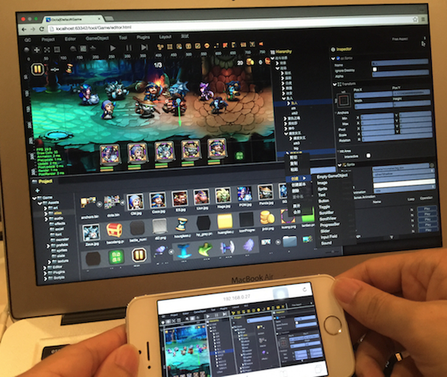

## Technology Stack

QICI Engine is based on the free and open source HTML5 game framework [Phaser](http://phaser.io/), which uses [Pixi.js](http://www.pixijs.com/) for WebGL and Canvas rendering across desktop and mobile web browsers. 

Phaser is actively developed and maintained by [@photonstorm](https://twitter.com/photonstorm), but QICI Engine uses the specific version Phaser 2.3.0. We keep track of bug fixes and performance improvements for Phaser, so you can use the customized Phaser version that QICI Engine provides safely.

QICI Engine is made up of three parts: QICI Core, QICI Widget and QICI Editor:  

- **QICI Core**: A JavaScript Game Engine library that is based on Phaser.
- **QICI Widget**: A JavaScript UI library for creating rich application.
- **QICI Editor**: A web-based editor with a [Node.js](http://nodejs.org/) server for accelerating HTML5 game development.

The QICI Core is the core of QICI Engine, the QICI Editor would not work without it, but the QICI Core can function on its own to be used to make a HTML5 Game by writing code without QICI Editor. But for complex UI, it’s really hard to build and maintain without the help of WYSIWYG visual interface, with QICI Editor even artists and designers can help to build the game’s UI. 

QICI Widget provides the HTML5 UI widgets for making the GUI in QICI Editor.

QICI Core is a JavaScript Game library, QICI Widget is a JavaScript UI library, and QICI Editor uses Node.js for accessing the file system, so QICI Engine is a Full-Stack JavaScript Game Engine.

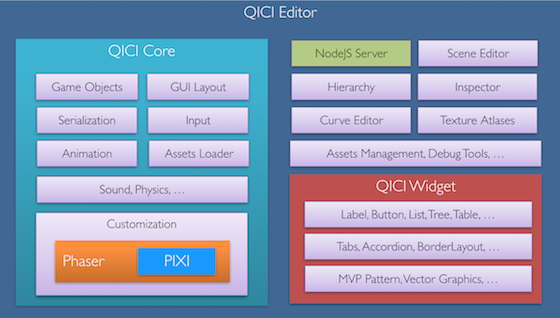

## Features

- **QICI Core**
    - WebGL and Canvas rendering support
    - [UI Components](http://docs.qiciengine.com/manual/UI/Sample.html): Toggle, Slider, ProgressBar, ScrollView, List, Table, etc.
    - [Rect Transform](http://docs.qiciengine.com/manual/UI/BasicLayout.html) UI Layout
    - [DragonBones](http://docs.qiciengine.com/manual/DragonBone/index.html) skeleton animation data format support       
    - [NinePatch image](http://docs.qiciengine.com/manual/NinePatch/index.html)
    - [NodeMask](http://docs.qiciengine.com/manual/BuildinComponents/NodeMask.html) and [Filter](http://docs.qiciengine.com/manual/Filter/index.html) effect
    - Mixing [Dom](http://docs.qiciengine.com/manual/Sample/Dom.html) and Canvas
    - [Web fonts](http://docs.qiciengine.com/manual/WebFont/index.html) and [Bitmap fonts](http://docs.qiciengine.com/manual/BitmapFont/index.html)
    - [JSON Tiled map editor file support](http://docs.qiciengine.com/manual/Sample/Tilemap.html)
    - [Web Audio and Audio Tag](http://docs.qiciengine.com/manual/Sound/index.html)
    - [Tween animation](http://docs.qiciengine.com/manual/Tween/index.html)
    - [Behavioural oriented architecture](http://docs.qiciengine.com/manual/Behaviour/index.html)
    - [Asset Management](http://docs.qiciengine.com/manual/AssetsLoad/index.html)
    - [Serialization](http://docs.qiciengine.com/manual/Serializer/index.html) with scene and prefab
    - Mouse, Keyboard and Touch support
    - [Import data from Excel](http://docs.qiciengine.com/manual/Excel/index.html)
    - Plugin system with official plugins like [Arcade Physics](http://docs.qiciengine.com/manual/Plugin/Arcade.html) and [Lock Orientation](http://docs.qiciengine.com/manual/Plugin/LockOrientation.html)
- **QICI Editor**
	- [Project Management](http://docs.qiciengine.com/manual/Project/index.html)
	- [Scene Management](http://docs.qiciengine.com/manual/Scene/index.html)	
	- [Hierarchy panel](http://docs.qiciengine.com/manual/Interface/Hierarchy.html), [Scene panel](http://docs.qiciengine.com/manual/Interface/Scene.html) and [Inspector panel](http://docs.qiciengine.com/manual/Interface/Inspector.html)
	- [Texture atlases](http://docs.qiciengine.com/manual/Atlas/index.html)
    - [Frame Animation](http://docs.qiciengine.com/manual/FrameAnimation/index.html) 
	- [Editing tween curve](http://docs.qiciengine.com/manual/Tween/index.html)
	- [Editing NinePatch](http://docs.qiciengine.com/manual/NinePatch/index.html)
	- [Import and preview skeleton animation](http://docs.qiciengine.com/manual/DragonBone/index.html)
	- [Extending Editor](http://docs.qiciengine.com/manual/ExtendEditor/index.html)
	- [Project settings](http://docs.qiciengine.com/manual/Settings/index.html)
	- [Publishing Project](http://docs.qiciengine.com/manual/Publish/index.html)

You can even run QICI Editor in your mobile device browsers:  
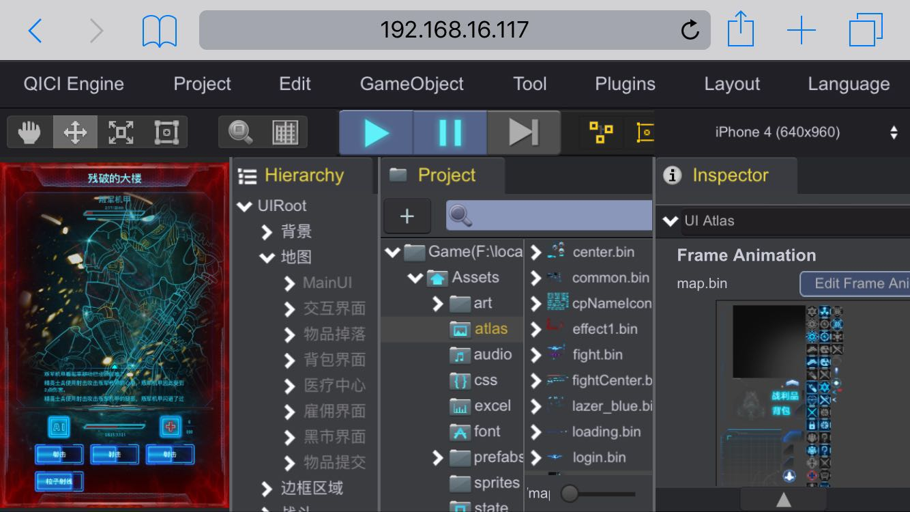 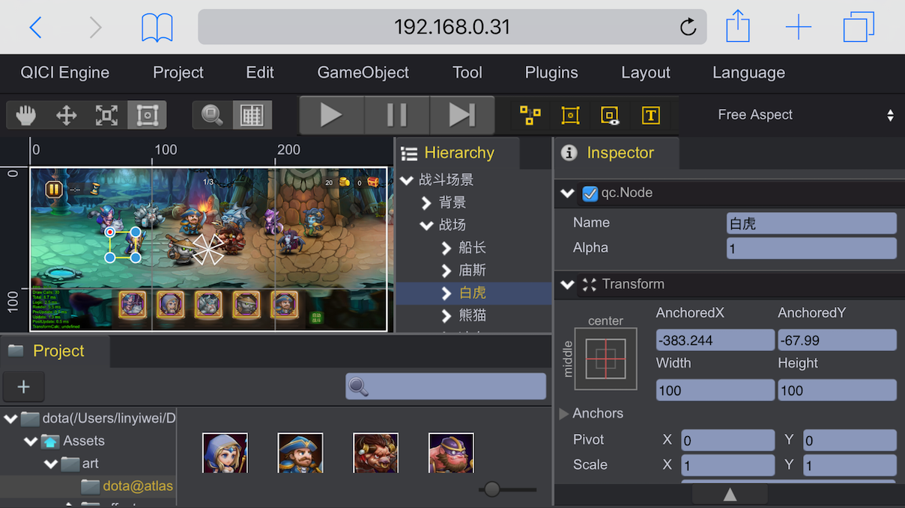 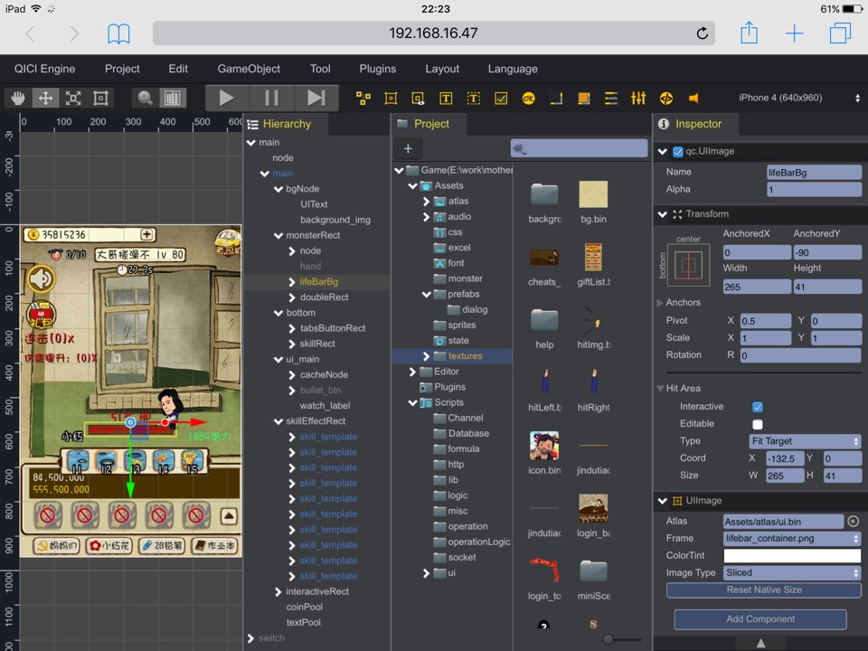

## Getting Started

- Follow the [Installation Guide](http://docs.qiciengine.com/manual/Overview/Install.html) to install [Node.js](http://nodejs.org/) and the latest [QICI Editor](https://github.com/qiciengine/qiciengine/blob/master/release-notes.md).
- Read the [Project Management Guide](http://docs.qiciengine.com/manual/Project/index.html) to create a new project.
- Read the [Scene Editing Guide](http://docs.qiciengine.com/manual/Scene/index.html) to create a new scene.
- Read the [UI and Components Guide](http://docs.qiciengine.com/manual/UI/index.html) to add some components on the scene.
- Press the "Run" button from the [Toolbar](http://docs.qiciengine.com/manual/Interface/ToolBar.html) or select the "Edit/Preview(WebGL)" item from the [Main Menu](http://docs.qiciengine.com/manual/Interface/MainMenu.html) to play and test the game.

## Documentation

The website’s documentation is divided into multiple sections.

- There are [Guides](http://docs.qiciengine.com/manual/index.html) that discuss topics like [Using Editor](http://docs.qiciengine.com/manual/Interface/index.html), [UI and Components](http://docs.qiciengine.com/manual/UI/index.html), [Official Plugins](http://docs.qiciengine.com/manual/Plugin/Official.html) and [Extending Editor](http://docs.qiciengine.com/manual/ExtendEditor/index.html).
- The [API Documentation](http://docs.qiciengine.com/api/index.html) for QICI Core
- The Demo Guides teaching you to build the demo step by step.
    - To be continued...

## Examples

A wide range of [source code examples](http://engine.qiciengine.com/demo/) for you to explore. Download all in [one zip](http://engine.qiciengine.com/demo/QICI_Demos.zip) file.   

<a href="http://engine.qiciengine.com/demo/Project/dota/index.html" target="_blank">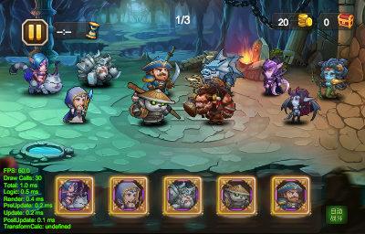</a> <a href="http://engine.qiciengine.com/demo/Project/tower/index.html" target="_blank">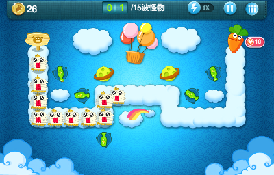</a>
<a href="http://engine.qiciengine.com/demo/Project/sources/index.html" target="_blank">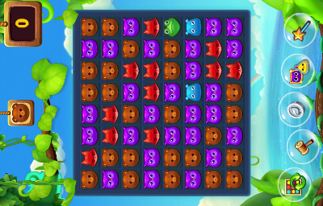</a> <a href="http://engine.qiciengine.com/demo/misc/performance/index.html" target="_blank">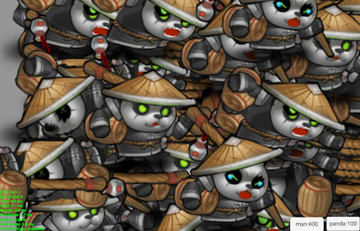</a>
<a href="http://engine.qiciengine.com/demo/misc/widgets/index.html" target="_blank">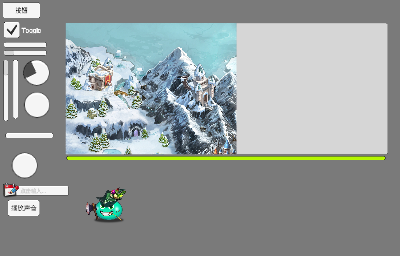</a> <a href="http://engine.qiciengine.com/demo/Layout/slime/index.html" target="_blank">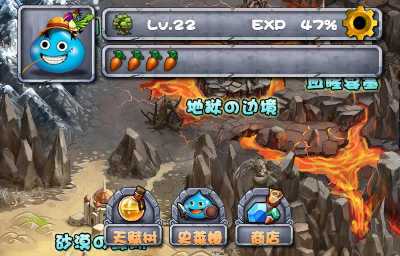</a>
<a href="http://engine.qiciengine.com/demo/Layout/tablelayout/index.html" target="_blank">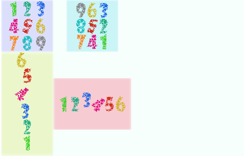</a> <a href="http://engine.qiciengine.com/demo/Tilemap/tilemap_Mario/index.html" target="_blank">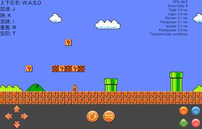</a>
<a href="http://engine.qiciengine.com/demo/Layout/qq/index.html" target="_blank">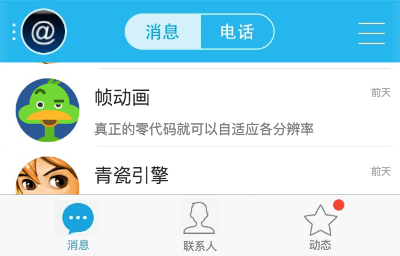</a> <a href="http://engine.qiciengine.com/demo/Layout/anchors/index.html" target="_blank">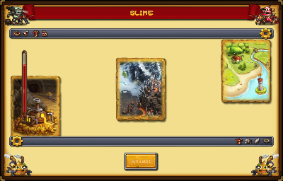</a>
<a href="http://engine.qiciengine.com/demo/ProgressBar/progressBar_mixed/index.html" target="_blank">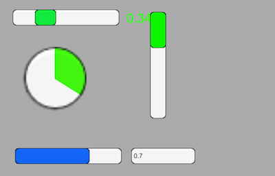</a> <a href="http://engine.qiciengine.com/demo/UIText/text/index.html" target="_blank">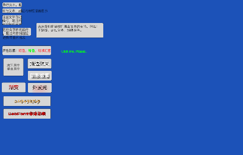</a>

## Opening Issues

If you encounter a bug with QICI Engine we would like to hear about it. Search the [existing issues](https://github.com/qiciengine/qiciengine/issues) and try to make sure your problem doesn’t already exist before opening a new issue. It’s helpful if you include the version of QICI Engine and browser you’re using. Please include a stack trace and reduced repro case when appropriate, too.

QICI Engine issues are intended for bug reports and feature requests. For help and questions with using QICI Engine please make use of our [Ask forum](http://ask.qiciengine.com/). If you want to hang out and chat about game dev in general, please join our slack channel in [Stay In Touch](#stay-in-touch) section.

## Contributing

QICI Engine Core:[https://github.com/qiciengine/qiciengine-core](https://github.com/qiciengine/qiciengine-core)
QICI Engine Documentation:[https://github.com/qiciengine/qiciengine-documentation](https://github.com/qiciengine/qiciengine-documentation)
QICI Engine Examples:[https://github.com/qiciengine/qiciengine-examples](https://github.com/qiciengine/qiciengine-examples)
QICI Engine Cookbook:[https://github.com/qiciengine/qiciengine-cookbook](https://github.com/qiciengine/qiciengine-cookbook)
Lightweight Game Server: [https://github.com/qiciengine/qiciengine-server](https://github.com/qiciengine/qiciengine-server)

Everybody is welcomed to report issues or pull requests for all the GitHub repositories mentioned above.

## Changelog

Details changes for each release are documented in the [release notes](release-notes.md). We recommend you use the latest version of QICI Engine.

## Stay In Touch

If you have questions with using QICI Engine please visit our [Ask forum](http://ask.qiciengine.com/), We will answer your questions ASAP.

If you use [Slack](http://slack.com/) and would like to join the [QICI Engine channel](http://qiciengine.slack.com) then please [drop we an email](mailto:linyw@qcplay.com?subject=Slack Invite&body=Please invite me to the QICI Engine slack channel.%0A%0AMy%20email%20address%20is%3A%20___%0AMy%20first%20name%20is%3A%20___%0AMy%20last%20name%20is%3A%20___). All we need is your email address, first name and last name and then we can send you an invite to the channel.

If you want to keep up to date with the latest QICI Engine news then just follow us on [Twitter](https://twitter.com/qiciengine) and we will keep you posted!

For more Information, please visit our official [QICI Engine webstie](http://www.qiciengine.com) or [Chinese website](http://www.zuoyouxi.com). 

If you have any questions or if there is something we didn’t cover, please feel free to contact me at [email](mailto:linyw@qcplay.com) or [Twitter](http://twitter.com/sailing8036).

## License

QICI Engine is released under the [MIT License](http://opensource.org/licenses/MIT).
